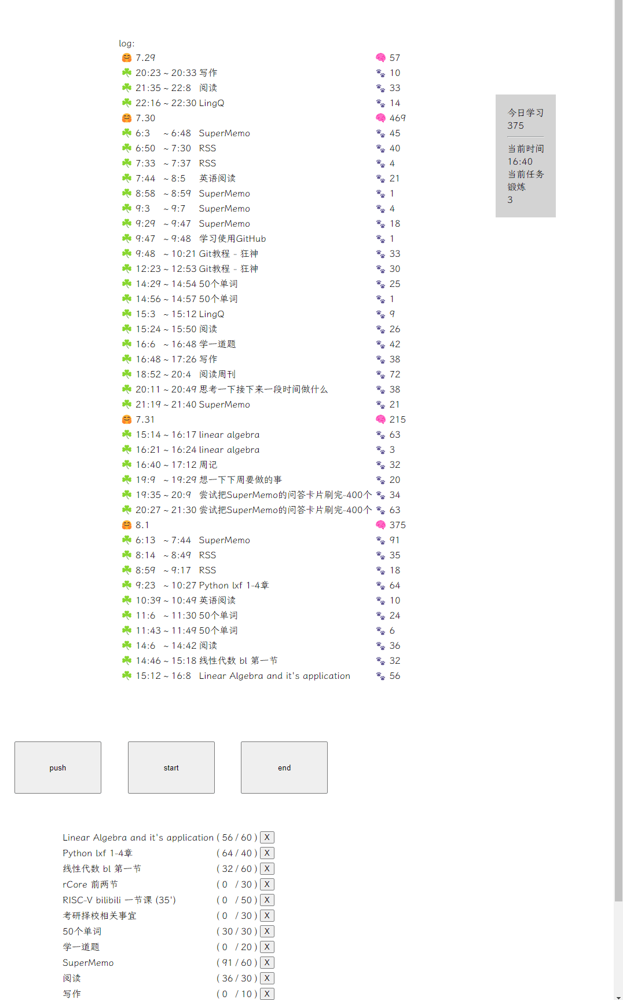

# time-daily
是个辅助我记日记的东西, 类似柳比歇夫的时间管理法.

## 使用说明

`push`用来添加任务和预期完成时间. 我一般一天开始的时候在任务清单中看看今天要做什么事情, 然后push进去.

`start` 用来开始一项任务

`end` 用来结束任务, 并增添一项记录

## 默认任务

你可以设置对于星期几或者几号的默认任务.

你可以在源代码的200行后找到一些被注释的代码, 这些地方可以设置默认任务. 在那里我也留了我自己的每日任务, 包括锻炼身体, 读书之类的. 你可以参照这个来编辑自己的默认任务.

## bug

好像没啥bug了, 就是不太健壮, 如果按钮的顺序不合逻辑, 可能会出现奇怪的结果.

## 其它

哈哈, 我用HTML + CSS + JavaScript写的, 原因是我不会写别的gui, 这就导致了我没法读写本地文件, 不然我还可以写到本地的日记.txt里面. 这样子只能复制粘贴了.

## 示例

